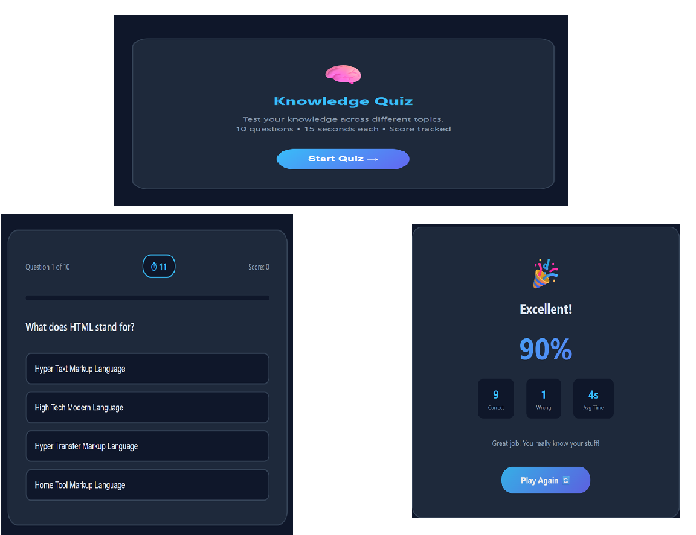

# 🧠 Knowledge Quiz App

An interactive quiz web app that tests your knowledge with timed questions, 
instant feedback, and a detailed results screen.

## 📸 Screenshot

## ✨ Features
- 10 multiple choice questions
- 15 second countdown timer per question
- Instant right/wrong feedback with explanation
- Score tracked live during the quiz
- Progress bar showing quiz completion
- Detailed results screen with percentage score
- Average time per question tracked
- Play again without refreshing

## 🎯 Result Grades
| Score | Result |
|-------|--------|
| 100% | 🏆 Perfect Score |
| 80% - 99% | 🎉 Excellent |
| 60% - 79% | 👍 Good Job |
| 40% - 59% | 📚 Keep Studying |
| Below 40% | 💪 Keep Practicing |

## 🛠️ Tech Stack
- HTML
- CSS
- JavaScript

## 📁 Project Structure
quiz-app/
├── index.html
├── css/
│   └── style.css
├── js/
│   └── script.js
└── screenshot.png
## 🚀 How to Run
1. Clone the repository
2. Open `index.html` in any browser
3. Click Start Quiz and test your knowledge!

## 💡 Why I Built This
I wanted to build something interactive that goes beyond static pages.
This project helped me understand DOM manipulation, timers, 
and dynamic UI updates using vanilla JavaScript.

## 👨‍💻 Author
**Zayeem Ajaj Sayyed**
BBA (Computer Applications) — Foresight College, Pune
[GitHub](https://github.com/ZayeemSayyed)
